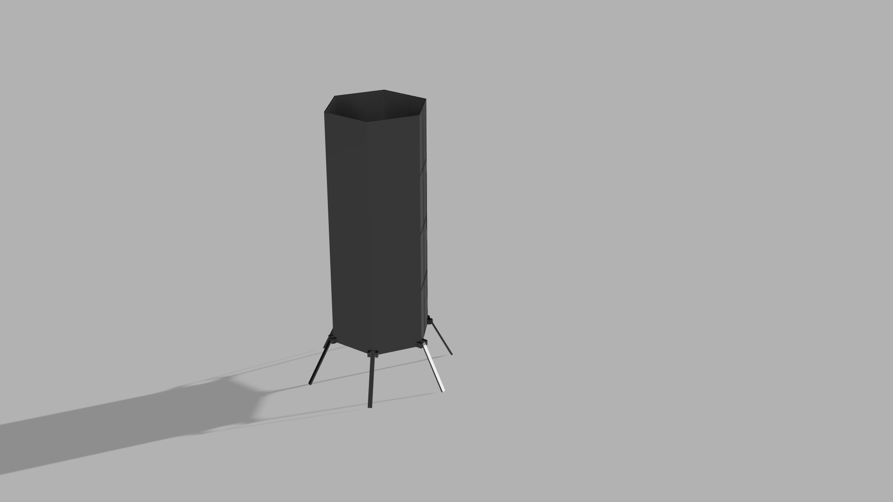

# Kooper

__Satellite for exploration of the planet "Uranus" and its satellites__

<a>
	<h2>Uranus</h2>
	</img>
</a>
<a>
	<h1>Moons of Uranus</h1>
	<h2>Miranda</h2>
    	</img>
    	<h2>Titania</h2>
    	</img>
</a>
